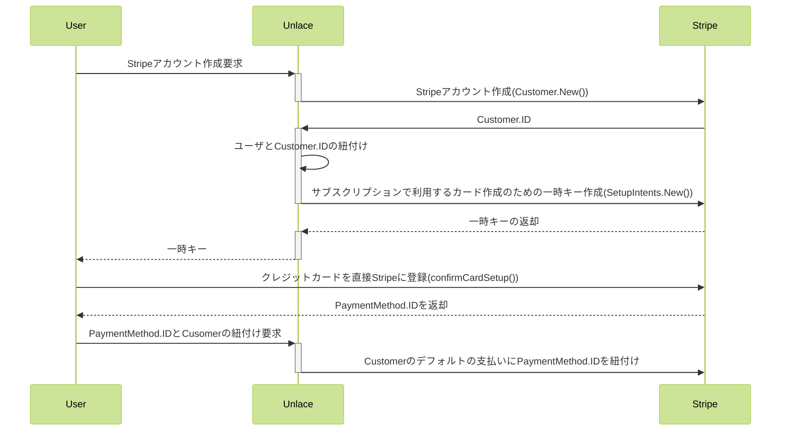
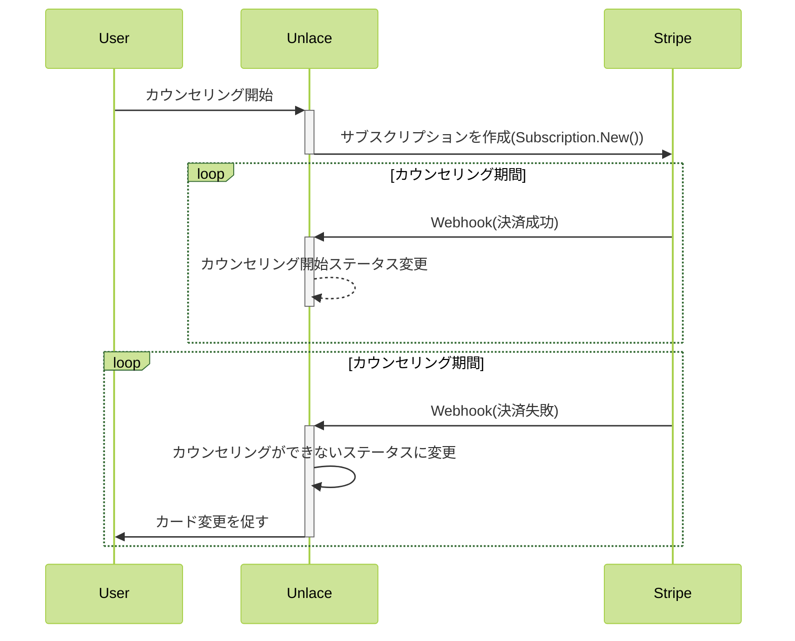
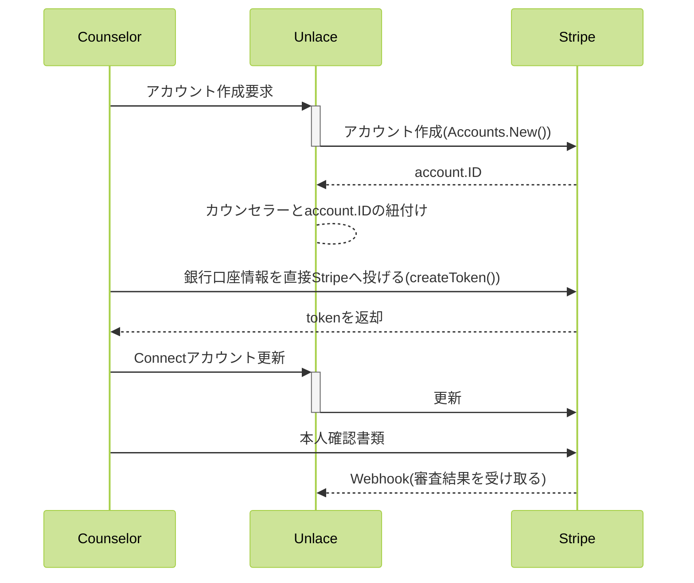

## はじめに

こんにちは。[Unlace](https://www.unlace.net/?utm_campaign=unlace_f_tech_zenn)でエンジニアをしている、栗栖([@ryomak](https://twitter.com/ryomak_13))です。  
前職では決済システムの開発・運用業務をしていて、 2020年からUnlaceにJoinし、主にバックエンドを開発しています。   
リリースから約1年半ほどバックエンドの開発運用をしたなかで、特に苦労したのは、決済基盤です。
決済基盤について、書きたい(振り返りたい)内容が多かったので、前半と後半に分けて記事を書こうと思います。

前半は、Unlaceの全体の決済フローを見ていただきながら、要件に対してどのようにStripeを活用したのかをまとめます。
後半では、一番苦戦したところなので、事業の意思決定のために必要な、決済に対する分析の設計について書く予定です。

今回の記事は、前半にあたります。
全体的なUnlaceにおけるStripeを利用した決済基盤の導入と実際に開発をする中でぶつかった壁とその対応事例についてです。

## Unlaceについて
まずはUnlaceについて説明します。  
[Unlace](https://www.unlace.net/?utm_campaign=unlace_f_article_zenn)は、主にユーザ向けのテキストカウンセリングを含むメンタルヘルスケアのサービスを提供しています。  


加えて、登録カウンセラーの方が利用するUnlace for counselorや、企業が従業員に対してUnlaceの利用料金を負担する仕組みを提供する[Unlace for business](https://www.unlace.net/business?utm_campaign=unlace_f_tech_zenn)も提供しています。


プロダクトは、ユーザ向け(web/ios/android)、カウンセラー向け(web/ios/android)、企業向け(web) とフロント7つを開発運用しています。  
APIサーバーにはGo、ユーザ・カウンセラー向けのWeb/AppをReact Nativeを採用しています。    
エンジニアは僕含めて2人なので踏ん張って開発しています。
2人でも開発効率を下げないよう共通部分が沢山あります。 フロントに関しては弊社フロントエンジニアの記事がありますので、こちらご覧ください。
https://zenn.dev/yuto_iwashita/articles/vite-monorepo

## 導入背景
サービスをリリースした当初は、公式LINEアカウントを利用してカウンセラーとカウンセリングができるというサービスをβ版として提供をしていました。  
決済については、LINE Payを利用していましたが、チャットシステムを自社のシステムに載せ替えるにあたって、制限が多いという課題がありました。  
また、合わせてカウンセラーへの支払いを手動で入金しており、カウンセラーが増えることに時間を圧迫していたという課題もありました。

これらを踏まえて、決済の仕組みを自由にカスタマイズでき、かつカウンセラーへの口座入金を実現するために、Stripeへ移行をすることに決めました。

## Unlaceにおける決済システム設計/実装
### サービスの決済フローの全体のイメージ

決済フローは画像にある通り、プラットフォームビジネスを展開しております。 

決済に関わる仕組みを全てStripeで完結させています。

#### 利用ユーザ
Unlace上でカウンセリングをしているユーザです。   
Stripeでは**Customer**にあたります。  
今回の記事では割愛しますが、Unlace for businessに登録している企業もCustomerとして利用しています

#### カウンセラー
Unlace上でカウンセリングを提供しているカウンセラーです。  
Stripe上では、**Connected Accounts**にあたります。(以下Connectアカウントとします)

### カウンセリングの支払い
ユーザ登録とカウンセリングのサブスクリプションのフロー図です。

#### ユーザのStripeアカウント登録


肝はカード情報はUnlaceを通さずに直接Stripeにリクエストしているところです。
改正割賦販売法の要件を満たすために必要な部分になります。  
クレジットカード情報の適切な管理をするためには、カード情報をネットワーク上の接続されたデバイスにて「通過」させない、「保存」しない、「処理」しないことが必要です。
これを実現するために、サーバ側にはStripeから発行されたトークンのみでやりとりを行います。
https://stripe.com/jp/guides/installment-sales-act

```go
param := &stripe.CustomerParams{
		Params: stripe.Params{
			Context: ctx,
		},
		Description:      stripe.String("hoge"),
		Email:            stripe.String("hogehoge@hoge.mail"),
		Name:             stripe.String("taro"),
		PreferredLocales: []*string{stripe.String("ja")},
	}
	if paymentMethodID != "" {
		param.PaymentMethod = stripe.String(paymentMethodID)
		param.InvoiceSettings = &stripe.CustomerInvoiceSettingsParams{
			DefaultPaymentMethod: stripe.String(paymentMethodID),
		}
	}
	cus, err := client.Customers.New(param)
	if err != nil {
		return nil, WrapError(err)
	}
```

#### ユーザのサブスクリプション

既にCustomerに支払い情報が紐づいているので、Subscriptionを開始するだけです。
適宜、決済エラーなどはWebhookで受け取って、DBにデータ反映しています。

```go
sub, err := client.Subscriptions.New(&stripe.SubscriptionParams{
    Params: stripe.Params{
        Context: ctx,
    },
    Items: []*stripe.SubscriptionItemsParams{
        {
            Price:    stripe.String(priceID),
            Quantity: stripe.Int64(1),
            TaxRates: []*string{stripe.String(taxID)},
        },
    },
    Customer:          stripe.String(customerID),
    ProrationBehavior: stripe.String("none"),
    PaymentBehavior:   stripe.String(string(stripe.SubscriptionPaymentBehaviorErrorIfIncomplete)),
    Coupon:            nil,
})
if err != nil {
    return nil, WrapError(err)
}
```

### カウンセラーへの支払い
StripeConnectではアカウントの種類が3つあります。 
Unlaceではカウンセラーに対してシームレスなUXを提供するために、StripeConnectの **Custom** アカウントを利用しています。

#### Standard
売り手自身がStripeのフォームからアカウント登録をし、Stripeの管理画面で売り上げを管理します。
https://stripe.com/docs/connect/standard-accounts
#### Express
売り手自身がアカウント登録をし、Stripeの管理画面で売り上げを管理します。
アカウントの登録などをプラットフォーム側で管理できるので、少しカスタマイズ性が上がります。
https://stripe.com/docs/connect/express-accounts
#### Custom
Stripeに関する全ての体験をプラットフォーム側がカスタマイズします。
https://stripe.com/docs/connect/custom-accounts

#### StripeConnectのアカウント登録フロー


銀行口座の情報や本人確認書類は直接Stripeへ通すことで、秘匿情報を持たなように設定しています。
Connectアカウントは銀行口座の振込があり、審査が必要なので、 Webhookで審査結果を受け取り、ステータスを更新します。
```go
　　account ,err := client.Account.New(&stripe.AccountParams{
    Params: stripe.Params{
        Context: ctx,
    },
    Settings: &stripe.AccountSettingsParams{
        Payouts: &stripe.AccountSettingsPayoutsParams{
            Schedule: &stripe.PayoutScheduleParams{
                Interval: stripe.String("manual"),
            },
        },
    },
    Capabilities: &stripe.AccountCapabilitiesParams{
        Transfers: &stripe.AccountCapabilitiesTransfersParams{
            Requested: stripe.Bool(true),
        },
    },
    Country:      stripe.String("JP"),
    Email:        stripe.String("hogehoge"),
    Type:         stripe.String("custom"),
    BusinessType: stripe.String(string(stripe.AccountBusinessTypeCompany)),
    BusinessProfile: &stripe.AccountBusinessProfileParams{
        MCC:                stripe.String("{MCC}"),
        ProductDescription: stripe.String("{description}"),
        URL:                stripe.String("{serviceURL}"),
    },
})
```
  


大まかな設計と実装の説明をしてきました。  
ここから実際運用する中でぶつかった壁をご紹介します。

## 第1の壁: サブスクリプションの終了日時からインボイスの確定に1時間のラグが存在する
### 背景
サブスクリプションは現在の終了日時をすぎると、サブスクリプションの更新と共に、次のインボイスを下書きのステータスで作成します。  
下書きのステータスのインボイスが作成された後は、すぐに請求されるのではなく、1時間経過してから請求されます。  
この1時間の誤差は、インボイスの内容を自由に変更できる時間として設けられているのですが、Unlaceでは、以下の理由より、この1時間の誤差をなくす必要がありました。
- インボイスが作成されてからアイテムを変更することがない
- 決済に利用できないカードを設定していた場合、サブスクリプションの期限が過ぎているのにもかからず、請求処理が行われないので、カウンセリングが余分にできてしまう

### Stripeの仕様
https://stripe.com/docs/billing/migration/invoice-states

### 対応
サブスクリプションの終了日時に次の下書きのステータスのインボイスが作成されるため、そのイベントを受け取るようにしました。
インボイス作成時に通知されるwebhookのイベント`invoice.created`を利用しました。  
このイベントをWebhook経由で受け取った場合、インボイスに対して、[Pay an invoice API](https://stripe.com/docs/api/invoices/pay)を叩き、即時請求するようにしました。

似たようなAPIとして、[Finalize an invoice API](https://stripe.com/docs/api/invoices/finalize)がありますが、こちらはinvoiceを下書きから確定にするだけなので、実際に請求はされません。
要件によって使い分けると良いと思います。


## 第2の壁： サブスクリプションのプランの支払いとプラン開始の時間を非同期にする
### 背景


ユーザがカウンセリングを開始するフローは以下です。
- 相談内容を回答
- 内容をもとに、マッチしたカウンセラーからコンタクトが届く
- カウンセリングとマッチング
- カウンセリングを開始

プランを購入は、相談内容を回答してからカウンセラーとマッチングまでの間で行います。   
なので仕様上、プラン購入とカウンセリングを始める間に、時間差が生じてしまいます。    
Unlaceではカウンセリングの期間をフルで利用してもらうために、サブスクリプションの開始時間をカウンセリング始めるタイミングと合わせる必要がありました。

### 対応
Stripeでサブスクリプションの作成(開始)をすると、同時に請求が走ります。    
プラン購入からカウンセリングの開始までの時間は未確定のため、サブスクリプションを単純に作成するだけだと対応できません。    

なので、プラン購入時でサブスクリプションを作成するのではなく、 PaymentIntentでの単発購入にし、カウンセリングを開始したタイミングから、サブスクリプションをを作る対応にしました。  

ただ、そのままサブスクリプションを作成すると、作成したタイミングから請求が走るため、サブスクリプション作成時の`BillingCycleAnchor`を次のプランの更新日時に指定することで、次のプランの更新日時から請求をするようにしました。 

トライアルという仕組みでも同じことを実現できますが、トライアルをを用いるとサブスクリプションを作成するタイミングで、インボイスが作成されてしまうため、BillingCycleAnchorを用いています。
```go
sub, err := client.Subscriptions.New(&stripe.SubscriptionParams{
    Params: stripe.Params{
        Context: ctx,
    },
    Items: []*stripe.SubscriptionItemsParams{
        {
            Price:    stripe.String(priceID),
            Quantity: stripe.Int64(1),
            TaxRates: []*string{stripe.String(taxID)},
        },
    },
    Customer:           stripe.String(customerID),
    ProrationBehavior:  stripe.String("none"),
    PaymentBehavior:    stripe.String(string(stripe.SubscriptionPaymentBehaviorErrorIfIncomplete)),
    BillingCycleAnchor: stripe.Int64(nextAt.Unix()),
    Coupon:             coupon,
})
```

#### 余談ですが
単発決済でよく使われるのは、オーソリ&キャプチャというのが、よく利用されます。  
オーソリはカードの与信枠を取りに行くことで、キャプチャは実際にカードに請求することです。
以下の例のように、先に決済させたくはないが、カード決済が問題ないかチェックしたい時は、オーソリをとってから、決済する際にキャプチャするという方法もあります。
```angular2html
ホテルはゲストの到着前に支払いを全額オーソリし、ゲストの決済時にその金額を移動することができます。
```
https://stripe.com/docs/payments/capture-later?locale=ja-JP

カード登録した際に履歴を見るとxx円引かれてから、xx円戻ってくるみたいなのサービスがあると思いますが、
それはカードが問題なく利用できるかをあらかじめチェックするためにオーソリを投げていたりします。

## 第3の壁： サブスクリプションのサイクルを伸ばす
### 背景
基本的にはプランによってカウンセリング期間が決まっていますが、カウンセラー側の体調不良などでお休みされることがあり、カウンセリングの日数が少なくなってしまうことがあります。  
この場合、カウンセリングできる日数が少なくならないよう、サブスクリプションの期間を伸ばす必要がありました。

### 結論
StripeのサブスクリプションはPriceで指定している期間を元に期間が決まっており、Schedule機能を使って短くはできますが、期間を先に伸ばすことはできません。  
そのため、Unlace側で独自にサブスクリプションの管理をするようにしています。  
具体的には、サブスクリプション期間を延ばす時のみ、一度Stripe側のサブスクリプションを終了させて、Unlace側で管理するようにしています。
次のプラン更新日で再度Stripe側に再度サブスクリプションを作成して、通常フローに戻すことで、擬似的に継続のサブスクリプションを再現しています。

## 第4の壁：Connectアカウントへの送金・入金ロジック
### 背景
初期のUnlaceではカウンセリングに対する報酬をカウンセラーへ支払う際は、手動で計算して、会社の口座から入金していました。  

しかし、カウンセラーが増える度に、この入金額の計算と入金作業にかかる時間が増えていったため、StripeConnectを利用した送金・入金処理を導入しました。

カウンセラーへの支払額の決定は、ユーザの契約しているカウンセリングに含まれているプランによって決定されます。

カウンセラーへの支払いに関して、複雑な仕様が2点あります。  
1. カウンセリング中にカウンセラーを変更できるため、必ずしもユーザの支払い(Charge)とカウンセラーへの支払いが1:1になるわけではありません。1つのカウンセリングにカウンセラーが複数対応した場合の支払額については、 カウンセリングの対応した日数によって、日割り計算をして割り振ります。
2. カウンセラーが報酬を振り込む際、 Unlaceの仕様で入金時の額に応じて手数料が変わるため、ユーザの支払いに対して、いくら入金できるのかは、口座に振り込む時に確定します。

### Stripeの仕様
Connectアカウントの口座に対しての入金にはフェーズが2つあります。
1. プラットフォームからConnectアカウントに対して送金する
2. ConnectアカウントのStripe残高からConnectアカウントの銀行口座へ入金処理を行う。

Stripeのドキュメントにおける、支払い(Charge)を、Connectアカウントへの送金する方法は大きく分けてには3つあります。 
#### ダイレクト支払い
支払い(Charge)をConnectアカウントに送金します。支払いの中からプラットフォーム側が受け取るFeeを指定することができます。  
この場合Stripeへの手数料はConnectアカウントが負担します。
https://stripe.com/docs/connect/direct-charges
#### デスティネーション支払い
支払い(Charge)をプラットフォームに送金します。支払いの中からConnectアカウントへの配分を指定することができます。こちらは、ダイレクトと違い、支払いのフローをコントロールすることができます。
この場合Stripeへの手数料はプラットフォーム側が負担します。
https://stripe.com/docs/connect/destination-charges
#### 支払いと送金別方式
支払い(Charge)をプラットフォームに送金します。時間を置いて送金したり、複数のConnectアカウントに送金したりする際に利用します。  
この場合Stripeへの手数料はプラットフォーム側が負担します。
https://stripe.com/docs/connect/charges-transfers

### 対応
要件を満たすためにはドキュメントに記載されている上記3つの方法では、実現できませんでした。
理由としては以下が挙げられます。
- Unlaceの仕様として送金ではなく、入金時の金額によって手数料が変わる。すなわち、チャージが起きたタイミングで手数料が確定していない
- 一度Connectアカウントに送金してから、プラットフォームに手数料を戻そうとすると、Stripeの送金手数料が余分にかかる
- カウンセラーが自由に入金する金額を選ぶことができる

ユーザの支払いに対して、額を計算することができないため、上記3つのChargeに対して、Connectアカウントの紐付ける方法は断念し、Unlaceの口座から、直接入金するようにしています。

このため、カウンセラーの入金する際の金額によって、手数料が変わるため、Unlaceのシステム側で残高を管理するようにして、入金する際は、Connectアカウントへの送金と入金処理を一度に行うようにしています。

## 第5の壁： Connectアカウントの口座への入金方式
### 背景
Unlaceでのカウンセラーへの支払いは、「月末の自動支払い」2つ目は「カウンセラー自身による手動支払い」の2パターンを実現する必要があります。
Stripe Connectを導入してから最初の振り込み時に、カウンセラーの方から「振り込み処理をしたが口座に入金されていない」と問い合わせが来たので、Stripeの担当者に仕様を確認するとともに、再度入金方式による対応方法を検討しました。

### Stripeの仕様
Stripeの入金スケジュールは以下2つあります。入金方式の仕組み
- 入金スケジュールはConnectアカウントごとに設定ができる
- どちらか1つの方式しか設定できない
- 設定の変更はいつでも可能だが、システムの反映に時間がかかることがあり、問い合わせの回答としては、入金の1週間前を目安に変更をしておくのがおすすめとのこと

| スケジュール | できること                       | できないこと                                                                |
|--------|-----------------------------|-----------------------------------------------------------------------|
| 自動入金   | 指定した日付で口座に着金させることができる       | 入金処理は着金日の2日以上前から作成されるため、入金処理から着金までの期間の支払いは次回以降に持ち越しになる                |
| 手動入金   | アプリケーション側で自由なタイミングで入金処理ができる | 着金には入金処理から1〜2営業日かかる(銀行側のシステム都合で2〜3営業日ずれる場合あり)。<br>着金日が土日祝日の場合、翌営業日に着金 |

### 対応
上記の仕様により、全てのConnectアカウントで手動入金を採用しました。
カウンセラーの手動入金時のみ、入金方式を「手動入金」に変更し処理が終わった後に、「自動入金」に戻すと手段も検討しましたが、以下の理由により採用しませんでした。
- 手動入金処理がが月末の自動入金の予定日と近い場合、バッティングしてしまう可能性がある
- 自動入金時に、Unlace側で管理しているカウンセラーの残高の同期に運用コストが発生する

手動入金を指定したので、入金処理開始から着金まで時間がかかるのは仕様としました。

ちなみに、SetStripeAccountを指定しないで、入金処理をすると、プラットフォームで設定している口座への入金になります。
```go
param := &stripe.PayoutParams{
    Params: stripe.Params{
        Context: ctx,
    },
    Currency: stripe.String(string(stripe.CurrencyJPY)),
    Amount:   stripe.Int64(amount),
}
param.SetStripeAccount(accountID) // これを外すと、プラットフォームへの入金になる
client.Payouts.New(param)
```

## Appendix: Stripeで良かったところ
### サポートが充実
Stripeはサポートが充実しています。
2022年7月現在はチャットとメールがあり、丁寧に仕様や原因を教えていただけます。
- チャット：　数分でレスポンス（対応:英語のみ)
- メール：1営業日ほどでレスポンス

要件の実現方法を相談して開発を進めました。
緊急度によってチャットとメールを使い分けていました。

### 管理画面が強力
Stripe提供されている管理画面がかなり強力です。  
基本的な主要な作業は、全てこの管理画面で完結します。  

**開発者向け**
やりとりしているデータも全て確認できます。なので、問い合わせ時の調査も、基本的には独自にログを取らなくても、管理画面で確認することができます。
- Webhookの実データの確認
- Webhookイベントの再送処理
- ユーザ毎のイベント
- 送信したAPIログ

**CSが対応する決済の作業**
- 顧客の支払い管理: 全額返金や部分返金、支払いの確認
- 商品の管理：サブスクリプションや、クーポンの作成・削除
- Connectアカウントの入金の調査・確認
CSが対応する時は基本この管理画面を使ってもらっていて、問い合わせの対応で利用する情報の検索や返金対応などを行っています。

また、管理画面で行ったイベントも全てWebhookで受け取れるので、カスタマイズ性が高いと思います。

### 自動で集計されるレポート機能がある
管理画面にはBillingアナリティクスがあり、さまざまな分析データが確認できます！
売上高の推移から、成長率や解約率など、充実しているレポートです！
Unlaceでは、さまざまな切り口でプロダクトを把握するため、細かい要件に耐えれるように独自でも分析基盤を構築しています。


## Appendix: ちょっとつまづいた仕様
### 管理画面ホームの売上額は正しくない場合がある。
管理画面のホームトップに表示される売上額が正しくないことがあります。
問い合わせたところ、以下の回答をいただきました。
- ホーム画面にあるレポートはリアルタイムのデータを提供する目的
- 会計グレードの精度で提供するように設計されていない
- データのズレはシステムで自動的に修正されるように設計されている

### 決済金額が0円の時のWebhookのinvoiceオブジェクトのパラメータが異なる
サブスクリプションの支払い成功のイベントは、invoiceオブジェクトがbodyに含まれています。
クーポン等を利用して、サブスクリプションの次の支払い金額が0円の場合は、chargeが発生しないため、chargeがnullで返却されるので注意が必要です。
```go
var chargeID *string
if invoice.Charge != nil {
    chargeID = &invoice.Charge.ID
}
```

### 通常のWebhook と ConnectのWebhookの設定
通常のイベントを受け取るWebhookで、Connectでの審査結果等のイベント名が表示されますが通常のwebhookで設定してもイベントが通知されることはありません。
Connectで利用するイベントは別途Webhookを設定する必要があります。以下画像の「連結アカウントでイベントをリッスンする」にチェックすると、ConnectのWebhookを受け取ることができます。


## まとめ
運用し始めてから1年半ほど経ち、要件が複雑になっていくため、かなり決済の仕組みも複雑になってきましたが、  
Stripeは仕様変更に柔軟に対応でき、かつ開発者にとって便利な機能が沢山あるため、導入してよかったなと感じています。
一方で、やはり決済は仕様が複雑になる為、全てStripeに任せるのではなく、要件・仕様とうまく付き合っていく必要があると感じました。

今回は前半部分として、全体的なUnlaceにおけるStripe決済の設計と導入についてでした。
次の記事では決済基盤の後半として、分析観点でのデータベース設計について書く予定です。

## さいごに
Unlaceは2020年12月にサービス開始してから、成長し続けています。
2022年7月現在、エンジニアは2人で開発しており、 まだまだたくさんのエンジニアが必要です！
ユーザの価値貢献につながるサービスを一緒に作りませんか？
https://job.unlace.net/


また、Unlaceでは様々な診断を用意しています！
個人的には認知の歪み診断は、思考の癖を知ることにに役立ちますので、お試しください！
https://unlace.net/testing/cognitive?utm_campaign=unlace_f_tech_zenn&transition=web
